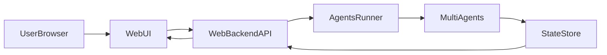

## 基于 openai-agents-python 的多智能体可视化 Web 项目方案

**首先回答你的核心问题：**
- **是否合适？** 基于你的目标（多智能体协作 + 前端“模拟人生”式可视化 + 复杂任务协同），`openai-agents-python` 非常适合作为 **后端智能体编排框架**：
  - 支持多 Agent 之间 **handoff/路由**，天然适配“角色分工、互相协作”的场景 [`AGENTS.md`、README 里的 handoffs 示例](https://github.com/openai/openai-agents-python)。
  - Agent 支持 **工具调用 / 函数工具**，可以挂接你 Web 项目的业务 API、数据库、任务系统等。[README 中的 function_tool 示例](https://github.com/openai/openai-agents-python)。
  - 有 **Session/记忆机制**，可以让每个“人物/房间/任务”有独立对话历史和长任务流程。
  - 可以与 Web 后端框架（FastAPI、Django 等）一起使用，对前端只暴露 HTTP/WebSocket 接口即可。
- **但要注意：**
  - `openai-agents-python` 只解决“智能体逻辑和编排”，**不提供 3D/2D 可视化 UI**，前端“模拟人生”效果需要你自己用 React + Canvas/Three.js/游戏引擎实现。
  - 实时同步（状态刷新、动画）需要你额外设计 **状态数据结构 + 推送机制（轮询/WebSocket）**。

下面是一个针对你需求的整体实施方案（后端 + 前端 + 集成）。

---

## 总体架构设计

用一个简化架构图说明后端 agents 和前端可视化的关系：

- **`AgentsRunner` + `MultiAgents`**：基于 `openai-agents-python` 实现多智能体协作逻辑（角色、工具、handoff、会话）。
- **`StateStore`**：负责维护“游戏世界状态”（每个智能体的位置、情绪、任务进度等），可以先用内存/SQLite，后期上 Redis/PostgreSQL。
- **`WebBackendAPI`**：用 FastAPI/Flask/Django 封装，与前端通信（创建场景、下发任务、订阅状态）。
- **`WebUI`**：前端 React/Vue + Canvas 或 3D 引擎，实现“模拟人生”式的角色和环境渲染。

---

## 后端：本地安装 & Agents SDK 集成

1. **本地开发环境准备（Windows）**
   - 安装 Python (3.10+ 推荐)。
   - 使用 `uv` 或 `pip` 建立隔离环境。
   - 在你的项目根目录（例如 `duozhinengti1`）中：
     - 创建 `backend/` 目录用于后端。
     - 在 `backend/` 里初始化虚拟环境并安装：
       - `openai-agents-python`（主角） [`openai-agents-python` README 安装说明](https://github.com/openai/openai-agents-python)。
       - 一个 Web 框架（例如 `fastapi` + `uvicorn`）。

2. **引入 Agents SDK 的基础 Hello World（验证本地环境）**
   - 在 `backend/` 中新增 `hello_agents.py`：
     - 按 README 中的 Hello World 示例创建一个简单 `Agent`，用 `Runner.run_sync` 跑一句话，确保 API key 配置正确。
   - 确认在本机命令行能输出正常结果，这一步是后续复杂开发的基础。

3. **多智能体协作建模（贴合小王子卡通风格）**
   - 场景初始：用户是“上帝视角”，虚拟城市里有 3 个卡通化智能体（参考小王子童话风格），他们都具备编程知识且绝对服从用户，目标是帮助用户完成复杂问题分析，并输出通俗、易懂的结果，同时用编程把想法可视化。
   - 在 `backend/agents/` 下设计固定三角色，并在 `instructions` 中锁定人设和分工：
     - **`MathematicianAgent`（数学家）**：偏理性与推理，负责公式化思考、验证、推导；对外输出时必须把复杂概念转成通俗解释。
     - **`ArtistAgent`（艺术家）**：偏创意与表达，负责视觉/叙事方案，擅长把结果转成图示草图、配色建议、布局想法；用简单语言让非技术人也能懂。
     - **`EngineerAgent`（工程师）**：偏实现与可视化编程，把想法转为可运行的代码片段/前端原型，保持鲁棒性和可执行性。
   - 协作规则建议：
     - 用户的需求先由 `MathematicianAgent` 分解并给出论证，必要时 handoff 给 `ArtistAgent` 提出视觉/叙事方案，再 handoff 给 `EngineerAgent` 产出代码/可视化实现；完成后由任一 agent 汇总，保证回答简洁、通俗。
     - 若用户直接要求代码/可视化，`EngineerAgent` 可主导，但在需要创意或解释时主动请求 `ArtistAgent`/`MathematicianAgent` 补充。
   - 使用 `function_tool` 定义工具，例如：
     - `update_world_state(agent_id, delta)`：更新游戏世界状态（位置、情绪、当前任务）。
     - `query_world_state()`：获取当前世界状态的抽象描述（供前端渲染卡通形象）。
     - （可选）`render_idea_to_svg(spec)`：把 `ArtistAgent` 的设计思路转成简单 SVG/Canvas 指令，供前端直接展示。

4. **会话与“场景/房间”管理**
   - 使用 README 中的 `SQLiteSession` 示例：
     - 每个“房间/场景”或“用户会话”对应一个 `session_id`，长期记住该房间的交互历史。
   - 在 `backend/sessions.py` 里封装 `get_session(room_id)`、`clear_session(room_id)` 等帮助函数。

5. **对外统一的 Agent Runner 接口**
   - 在 `backend/app.py`（FastAPI 应用）中：
     - 定义 `/api/rooms/{room_id}/message`：
       - 请求体：用户文本指令 + 可选参数（针对哪个智能体、全场广播等）。
       - 逻辑：
         - 根据 `room_id` 获取/创建 `SQLiteSession`。
         - 调用 `Runner.run(...)` 入口 agent（通常是 `PlannerAgent`），传入 session。
         - 拿到 `result.final_output` 以及过程中产生的世界状态变更，写入 `StateStore`。
         - 返回最新世界状态 + 本轮自然语言回复。
     - 预留 `/api/rooms/{room_id}/state` 用于前端拉取当前世界状态。
   - 如果后续要更实时，可以增加 WebSocket：`/ws/rooms/{room_id}`，在 Agent 运行过程中不断推送事件/状态。

6. **状态存储设计（StateStore）**
   - 在 `backend/state_store.py` 中定义统一接口：
     - `get_world(room_id)`：返回该房间所有 agent 的位置、状态、当前任务等（纯数据结构）。
     - `apply_events(room_id, events)`：根据 agent 工具调用返回的事件，更新世界状态。
   - 初期可以用 **内存字典 + 定期 dump 到 SQLite/JSON 文件**；后期再换成 Redis/PostgreSQL。

---

## 前端：“模拟人生”式可视化界面

1. **前端技术栈建议**
   - 推荐：`React` + `TypeScript` + `Vite` 或 `Next.js`。
   - 图形层选项：
     - 2D：`PixiJS` / `Canvas` / `Konva`，适合上手快、风格化 UI。
     - 3D：`three.js` + `react-three-fiber`，适合更像游戏的体验。

2. **数据模型与 UI 映射**
   - 与后端 `StateStore` 定义统一的传输结构，例如：
     - `agents: [{ id, name, role, x, y, mood, currentTask, relations }]`
     - `environment: { rooms, objects, timeOfDay, weather }`
   - 前端根据这个 JSON：
     - 把每个 `agent` 渲染成一个“人物小人”，显示表情/情绪颜色、任务文字气泡。
     - 把环境渲染为房间布局、家具、交互物品。

3. **与后端交互**
   - 页面加载时：
     - `GET /api/rooms/{room_id}/state` 初始化世界状态。
   - 用户在 UI 中的操作（例如点击某个智能体并下达任务）：
     - 调用 `POST /api/rooms/{room_id}/message`，包含自然语言命令或结构化指令。
     - 收到响应后更新本地状态（或等待 WebSocket 推送）。
   - 如果使用 WebSocket：
     - 前端维护 `useEffect` 建立 socket 连接，接收状态更新事件（`agent_moved`, `task_started`, `task_finished` 等），实时更新 React 状态并触发动画。

4. **“模拟人生”交互细节建议**
   - 支持给智能体设置：
     - 性格特征（谨慎/冒险、合作/竞争等）——通过 Agent `instructions` 或自定义系统提示控制。
     - 职业/专长（规划师、工程师、测试、产品经理等）。
   - 让智能体之间的对话与协作：
     - 在后端 agent 层，用 handoff 或“针对其他 agent 的工具调用”，实现他们在后台互相沟通，而前端只是可视化这个过程（对话气泡、行动路线）。

---

## 与 openai-agents-python 深度集成的一些建议

- **Tracing/调试**：
  - 利用 SDK 自带的 tracing，将每次运行的 span 记录下来，方便调试“哪个 agent 在什么时候做了什么决定”。
  - 可以在开发阶段把这些 trace 信息打印在后端日志中，定位多智能体协作的逻辑 bug。

- **结构化输出（output_type）**：
  - 为某些 agent（比如 `PlannerAgent`）设置 `output_type`，返回严格结构的 JSON，例如任务列表、事件列表，这样更容易被 `StateStore` 消化并映射到前端动画。

- **工具与权限边界**：
  - 给不同角色 agent 配置不同的工具：
    - 例如只有 `PlannerAgent` 能创建新任务，`WorkerAgent` 只能更新任务进度。
  - 避免“每个 agent 都能调用所有工具”，否则行为会难以控制。

---

## 开发与本地部署流程

1. **本地后端运行**
   - 在 `backend/` 中：
     - 使用 `uvicorn app:app --reload` 启动 FastAPI 服务。
     - 确保环境变量 `OPENAI_API_KEY` 已在 PowerShell 中设置。
   - 用 `curl/Postman` 或浏览器先调用 `/api/health`、`/api/rooms/demo/state` 等简单接口，确认无误。

2. **本地前端运行**
   - 在项目根目录新增 `frontend/`，用 `npm create vite@latest` 或 `npx create-next-app` 等初始化。
   - 在前端 `.env` 中配置后端地址（例如 `VITE_API_BASE=http://localhost:8000`）。
   - `npm run dev` 启动前端，再通过浏览器访问、调试交互效果。

3. **后续扩展（可选）**
   - 把 Agents SDK 的会话存储从 SQLite 升级到 Redis，支持多进程后端和水平扩展。
   - 加入长任务工作流（结合 Temporal 或自定义任务队列），跑跨小时的复杂任务。
   - 增加用户系统，不同用户拥有不同的“城市/家庭/团队”。

---

## 总结

- **`openai-agents-python` 非常适合** 作为你这个“多智能体协作 + Web 可视化”的后端核心框架，用来管理角色、任务、工具和会话，是当前开源方案中比较轻量又功能完备的一类 [`openai-agents-python` 仓库](https://github.com/openai/openai-agents-python)。
- 真正的“模拟人生”体验主要取决于：
  - 你如何设计 **agent 角色、工具和世界状态**；
  - 前端如何 **把这些状态转成生动的动画和交互**。
- 下一步，如果你愿意，我可以按你现有的 `duozhinengti1` 目录，给出：
  - 具体创建 `backend/` 和 `frontend/` 的命令；
  - 一个最小可跑的多智能体 Demo（后端 Python 样例 + 前端 React 页面框架）。

